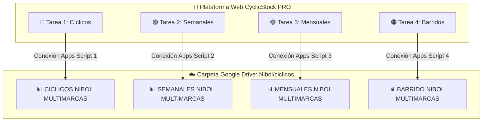

# 📗 Guía de Sincronización en Vivo Multi-Inventario con Google Sheets (Apps Script)

Esta guía te explica cómo conectar tus **4 libros de cálculo independientes** en Google Drive (`Nibol/ciclicos`) con la plataforma **CyclicStock PRO**, permitiendo que cada tipo de inventario funcione de manera aislada sin mezclar datos.

---

## 📂 Archivos en tu Carpeta Google Drive (`Nibol/ciclicos`)

| Tipo de Control | Archivo en Google Drive | Script a Implementar | Propósito Operativo |
| :--- | :--- | :--- | :--- |
| 🔵 **Cíclicos** | `CICLICOS NIBOL MULTIMARCAS` | [`google_apps_script/Code_CICLICOS.gs`](file:///google_apps_script/Code_CICLICOS.gs) | Conteos diarios rotativos por clasificación ABC. |
| 🟢 **Semanales** | `SEMANALES NIBOL MULTIMARCAS` | [`google_apps_script/Code_SEMANALES.gs`](file:///google_apps_script/Code_SEMANALES.gs) | Conteos programados por familias y pasillos. |
| 🟣 **Mensuales** | `MENSUALES NIBOL MULTIMARCAS` | [`google_apps_script/Code_MENSUALES.gs`](file:///google_apps_script/Code_MENSUALES.gs) | Cierre mensual y balance general de inventario. |
| 🟠 **Barridos** | `BARRIDO NIBOL MULTIMARCAS` | [`google_apps_script/Code_BARRIDO.gs`](file:///google_apps_script/Code_BARRIDO.gs) | Saneamiento de pasillos, stock cero y ajustes. |

---

## ⚡ ¿Cómo funciona la arquitectura Multi-Inventario?



1. **Sin mezclas de datos**: Cada tipo de inventario tiene su propia tarjeta de tarea, su asignación de auxiliar independiente, sus métricas IRA separadas y su propio historial.
2. **Pestañas por Centro**: Cada archivo contiene las pestañas de los centros (`1300`, `1800`, etc.) y genera automáticamente sus pestañas de auditoría separadas (`Auditoría - 1300`, etc.).
3. **Firmas y Cierres**: Al concluir y firmar un inventario, se genera automáticamente el archivo de cierre certificado en la carpeta `Nibol/ciclicos` de Google Drive.

---

## 🚀 Pasos de Implementación para cada Hoja (2 minutos por archivo)

Repite estos 4 pasos sencillos para cada uno de tus 4 archivos en Google Drive:

### Paso 1: Abrir el archivo en Google Drive
1. Ve a tu carpeta de Google Drive `Nibol/ciclicos`.
2. Abre el archivo correspondiente (ej: `SEMANALES NIBOL MULTIMARCAS`).

### Paso 2: Abrir Apps Script
1. En la barra superior, haz clic en **Extensiones** &rarr; **Apps Script**.
2. Borra cualquier contenido previo en `Código.gs`.

### Paso 3: Pegar el código del script correspondiente
Copia todo el contenido del archivo de script correspondiente:
- Para **CICLICOS NIBOL MULTIMARCAS**: [`google_apps_script/Code_CICLICOS.gs`](file:///google_apps_script/Code_CICLICOS.gs)
- Para **SEMANALES NIBOL MULTIMARCAS**: [`google_apps_script/Code_SEMANALES.gs`](file:///google_apps_script/Code_SEMANALES.gs)
- Para **MENSUALES NIBOL MULTIMARCAS**: [`google_apps_script/Code_MENSUALES.gs`](file:///google_apps_script/Code_MENSUALES.gs)
- Para **BARRIDO NIBOL MULTIMARCAS**: [`google_apps_script/Code_BARRIDO.gs`](file:///google_apps_script/Code_BARRIDO.gs)

Guarda los cambios con **Ctrl + S** (o el ícono 💾).

### Paso 4: Implementar como Aplicación Web (Deploy)
1. Haz clic en el botón azul superior **Implementar (Deploy)** &rarr; **Nueva implementación**.
2. Selecciona el tipo **Aplicación web** (ícono de engranaje ⚙️).
3. Configura:
   - **Descripción**: `API CyclicStock - [Nombre del Inventario]`
   - **Ejecutar como**: `Yo (tu cuenta de Google)`
   - **Quién tiene acceso**: `Cualquier usuario` *(Anyone)* &larr; **Obligatorio para que la web en Vercel o local pueda sincronizar**.
4. Haz clic en **Implementar** y autoriza los permisos si te lo solicita.
5. Copia la **URL de la aplicación web** (la que termina en `/exec`).

---

## ⚙️ Configuración en la Plataforma

Una vez desplegados los scripts, puedes ingresar las URLs en el sistema o en tus variables de entorno:

### En el archivo `data/config.json` o variables de entorno:
```json
{
  "syncMode": "google_sheets",
  "googleSheetUrl": "https://script.google.com/macros/s/AKfycbwpJ5klIWQmhhM4RNgxfG4QabqLOOb2KCVhLPhyIWvHeUsQ39wgHjMt3sHLJo9tH-9p/exec",
  "googleSheetUrls": {
    "ciclico": "https://script.google.com/macros/s/AKfycbwpJ5klIWQmhhM4RNgxfG4QabqLOOb2KCVhLPhyIWvHeUsQ39wgHjMt3sHLJo9tH-9p/exec",
    "semanal": "https://script.google.com/macros/s/AKfycbxCEDud8PvY4nF31KusgUAa9HJvTwxTzJQsyrfBcPb1cXp4Gg9vJJh_Xo6hQ91DcgnwZw/exec",
    "mensual": "https://script.google.com/macros/s/AKfycbyF903sRTv0jkn_nxAFEZogK0cY_sLSMkgJzViImuIgYMaBV_1MSI1hsINhmD43Gro4Cg/exec",
    "barrido": "https://script.google.com/macros/s/AKfycbysHHX9TYzpV3jDBvcDtcHmCAc0PO3vRpiivGqHz373qr4aB3mfmmcxjtWXhuemv3FyvQ/exec"
  }
}
```

---

## 🔒 Estructura Estándar de Columnas (Común en los 4 libros)

Todas las hojas de centros (`1300`, `1800`, etc.) comparten la misma cabecera de 16 columnas:

| Columna | Nombre de Campo | Tipo / Formato |
| :--- | :--- | :--- |
| **A** (1) | `SKU` | Texto / Código |
| **B** (2) | `Codigo_Barras` | Texto / EAN |
| **C** (3) | `Descripcion` | Texto descriptivo |
| **D** (4) | `Ubicacion` | Pasillo / Rótulo |
| **E** (5) | `Categoria` | Grupo / Familia |
| **F** (6) | `Clasificacion_ABC` | `A`, `B` o `C` |
| **G** (7) | `Unidad` | `UND`, `PZA`, etc. |
| **H** (8) | `Costo_Unitario` | Moneda / Decimal |
| **I** (9) | `Stock_Sistema` | Entero / Teórico |
| **J** (10) | `Stock_Fisico` | Entero contado |
| **K** (11) | `Diferencia` | `Stock_Fisico - Stock_Sistema` |
| **L** (12) | `Costo_Diferencia` | `Diferencia * Costo_Unitario` |
| **M** (13) | `Fecha_Ultimo_Conteo` | Fecha y hora ISO |
| **N** (14) | `Responsable` | Nombre del Auxiliar |
| **O** (15) | `Estado` | `PENDIENTE`, `SIN_DIFERENCIA`, `CON_DIFERENCIA` |
| **P** (16) | `Mal_Estado` | Cantidad de unidades defectuosas / rotas |
