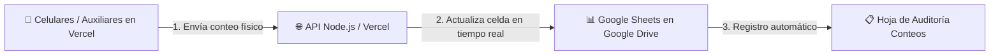

# 📗 Guía de Sincronización en Vivo con Google Sheets (Apps Script)

Con esta solución, tu aplicación web (tanto en **Vercel** como local) se comunica directamente con tu libro de cálculo en la nube de Google Drive. **No necesitas subir el archivo Excel a GitHub ni preocuparte por la pérdida de datos.**

---

## ⚡ ¿Cómo funciona?

1. Cada vez que un auxiliar guarda un conteo en su celular, la web escribe en **Google Sheets en tiempo real**.
2. Los supervisores pueden ver los conteos aparecer en vivo en la pantalla de su Google Sheet.
3. Se crea automáticamente una pestaña llamada **`Auditoría Conteos`** con el historial cronológico de quién contó, a qué hora y con qué diferencia.

---

## 🚀 Pasos de Configuración (Menos de 3 minutos)

### Paso 1: Subir el archivo a Google Drive
1. Entra a [Google Drive](https://drive.google.com).
2. Haz clic en **Nuevo &rarr; Subir archivo** y selecciona tu archivo `CICLICOS NIBOL MULTIMARCAS.xlsx`.
3. Haz doble clic en el archivo subido para abrirlo como **Google Sheets**.

---

### Paso 2: Abrir el editor de Apps Script
1. En la barra superior de tu Google Sheet, haz clic en **Extensiones** &rarr; **Apps Script**.
2. Se abrirá una nueva pestaña con el editor de código de Google.

---

### Paso 3: Pegar el código del Webhook
1. En el editor, borra cualquier texto que aparezca dentro de `Código.gs`.
2. Abre y copia todo el contenido del archivo [`google_apps_script/Code.gs`](file:///google_apps_script/Code.gs) incluido en este proyecto.
3. Pégalo en el editor de Apps Script y presiona el ícono de **Guardar** (Ctrl + S o 💾).

---

### Paso 4: Implementar como Aplicación Web (Deploy)
1. En la esquina superior derecha de Apps Script, haz clic en el botón azul **Implementar (Deploy)** &rarr; **Nueva implementación**.
2. Haz clic en el ícono de engranaje ⚙️ junto a *Seleccionar tipo* y elige **Aplicación web**.
3. Configura exactamente estos 3 campos:
   - **Descripción**: `API CyclicStock Pro`
   - **Ejecutar como**: `Yo (tu correo de Google)`
   - **Quién tiene acceso**: `Cualquier usuario` *(Anyone)* &larr; **Importante para que la web en Vercel pueda comunicarse**.
4. Haz clic en **Implementar**.
5. Google te pedirá autorizar permisos la primera vez:
   - Haz clic en *Revisar permisos* &rarr; Selecciona tu cuenta de Google &rarr; Haz clic en *Avanzado* &rarr; Haz clic en *Ir a API CyclicStock Pro (no seguro)* &rarr; *Permitir*.
6. Copia la **URL de la aplicación web** generada (termina en `/exec`). Ejemplo:
   `https://script.google.com/macros/s/AKfycb.../exec`

---

### Paso 5: Activar en tu Sistema CyclicStock Pro

Tienes **dos formas sencillas** de activarlo:

#### Opción A: Directamente desde el Panel Web (Recomendado)
1. Entra a tu página web (en Vercel o en local).
2. Inicia sesión como **Encargado** (ej: Usuario `JAVIER`, Contraseña `JVLP`).
3. Ve a la pestaña **Conexión Excel & Mapeo**.
4. Pega la URL en el campo **URL de la Aplicación Web de Google Apps Script**.
5. Haz clic en **Probar Conexión** (verás el punto verde y el nombre de tu libro).
6. Haz clic en **Guardar y Activar**. ¡Listo!

#### Opción B: Variable de Entorno en Vercel
1. En tu proyecto de [Vercel](https://vercel.com) &rarr; **Settings** &rarr; **Environment Variables**.
2. Agrega la variable:
   - **Name**: `GOOGLE_SHEET_URL`
   - **Value**: Tu URL terminada en `/exec`.
3. Haz un Redeploy en Vercel.

---

## 🔒 ¿Es necesario hacer público el archivo de Google Sheets?

* **NO.** El libro de Google Sheets **se mantiene 100% privado en tu cuenta de Google Drive**.
* Como la Aplicación Web se ejecuta bajo la opción **"Ejecutar como: Yo"**, el script de Google actúa como un intermediario seguro con permisos para leer y escribir en tu libro sin exponer tu cuenta ni hacer público el archivo a terceros.
